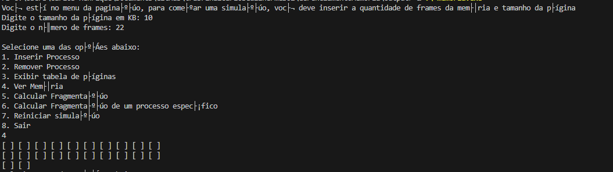
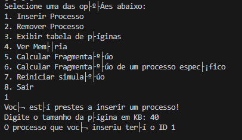
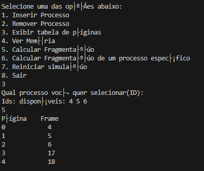
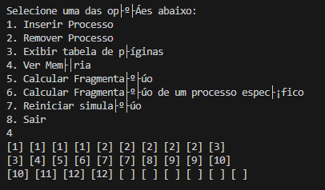
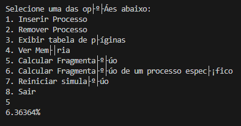
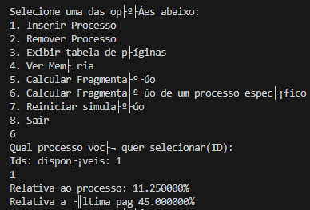

# Gerenciador de Memória

- **Carlos Henrique Güllich Scherer e Guilherme Grosselli**

## Descrição do Projeto

O projeto em questão visa criar um simulador como trabalho final da disciplina de Sistemas Operacionais II, que realize o que foi solicitado no tema 1: Gerenciamento de Memória se referindo aos modos de alocação contínua e paginação. O simulador tem o objetivo de demonstrar como são alocados, removidos e/ou reorganizados os processos na memória, além de mostar métricas para as fragmnetações, quando ocorridas.

## 🛠️ Linguagem e Interface

Desenvolvido puramente em Linguagem C++, via Sistema Operacional Windows, com sua execução e interação através de terminal de linha de comando (console), com menus interativos para navegação entre as opções de gerenciamento oferecidas.

## Compilação

```bash
#TDM-GCC (g++) no Windows 10/11 ou GCC/Clang em GNU‑Linux
g++ index.cpp contigua.cpp memoria.cpp -o simulador
```


## Execução

```bash
# Via terminal Linux/Unix:
./simulador
# Via cmd Windows:
simulador.exe
```

## Dependências e bibliotecas necessárias

Foram utilizadas somente bibliotecas nativas da própria linguagem C++.
algorithm, cctype, cmath, iomanip, iostream, map, string, vector


#  Decisões de projeto e arquiteturas adotadas
A parte de alocação contínua dinâmica ficou com o Guilherme enquanto a parte de paginação ficou com o Carlos. A implementação foi feita da maneira mais simples e didática que conseguimos pensar, usufruindo apenas de estruturas de dados mais simples como vetores e mapas, que já são capazes de implementar todos os conceitos que foram requisitados.

# exemplo de uso simulador paginação, 
definindo número de frames, tamanhoda página, mostrando memória

Inserindo processo

Removendo processo

Tabela de páginas

Ver memória

Fragmentação total

Fragmentação específica
